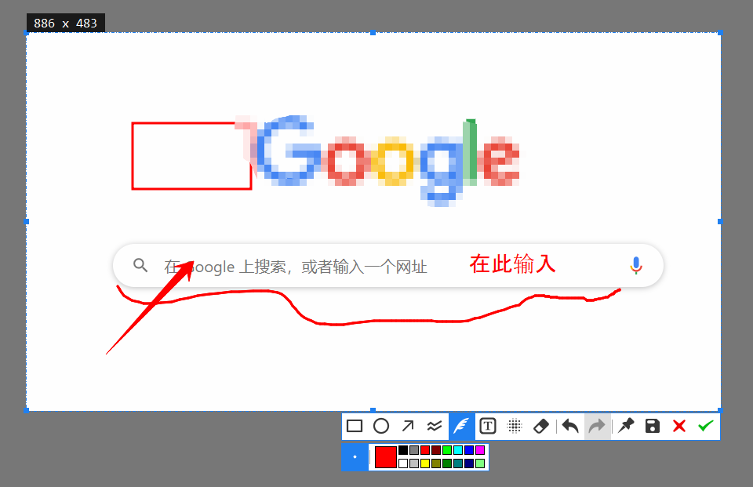

<p align="center">
    
</p>

<h1 align="center">Capturer</h1>

<p>
    <p align="center">
        <code>Capturer</code>是一款主打快速<code>截图</code>、<code>贴图</code>、<code>录屏</code>和<code>录制GIF</code>的软件
    </p>
    <p align="center">
        使用快捷键可以快速选择感兴趣的<code>桌面区域</code>或<code>窗口</code>进行截图/录制，并将截图快速<code>钉在桌面</code>上
    </p>
    <p align="center">
        
    </p>
</p>

## 下载 & 安装

- `>= Windows 10 1803`
- `>= Ubuntu 20.04`

> Not support Wayland on Linux

从 [Releases](https://github.com/ffiirree/Capturer/releases) 下载系统对应的版本。

### Windows

下载后解压，双击 `capturer.exe` 运行。

### Ubuntu

下载后安装：

```bash
sudo dpkg -i capturer-1.4.1-ubuntu_xx.04-amd64.deb
sudo apt install -f
```

## 快捷键

|       Keys       | Actions                             |
| :--------------: | ----------------------------------- |
|       `F1`       | 截图                                |
|       `F3`       | 贴图， 将剪切板中的内容贴在桌面上   |
| `Ctrl + Alt + V` | 录制视频，选择区域，`Enter`开始录制 |
| `Ctrl + Alt + G` | 录制GIF，选择区域，`Enter`开始录制  |

> 文件保存在系统默认的图片/视频文件夹中

### 选择框通用快捷键

|             Keys             | Actions        |
| :--------------------------: | -------------- |
|          `Ctrl + A`          | 全屏           |
| `W / A / S / D` or `↑ ← ↓ →` | 逐像素移动窗口 |
|       `Ctrl + ↑ ← ↓ →`       | 逐像素扩大窗口 |
|      `Shift + ↑ ← ↓ →`       | 逐像素缩小窗口 |
|            `ESC`             | 退出           |

### 截图

|          Keys          | Actions                          |
| :--------------------: | -------------------------------- |
|          `F1`          | 开始截图                         |
|          `P`           | 截图并贴图                       |
|       `Ctrl + S`       | 截图并保存到文件                 |
|        `Enter`         | 截图并保存到粘贴板               |
| `LButton` Double Click | 截图并保存到粘贴板               |
|       `Page Up`        | 上一次的截图位置                 |
|      `Page Down`       | 下一次的截图位置                 |
|       `Ctrl + C`       | 放大镜存在时，复制取色器中的颜色 |
|         `Tab`          | 放大镜存在时，切换取色颜色格式   |

### 编辑

|         Keys          | Actions                                                    |
| :-------------------: | ---------------------------------------------------------- |
|      `Ctrl + Z`       | UNDO                                                       |
|  `Ctrl + Shift + Z`   | REDO                                                       |
| `Ctrl + C`/`Ctrl + V` | Copy & Paste                                               |
|       `Delete`        | 删除选中的图形                                             |
|        `Shift`        | 椭圆->圆<br>矩形->正方形<br>直线->水平/垂直                |
|        `Space`        | 重新调整截图区域                                           |
|        `Wheel`        | 控制马赛克/橡皮擦直径 <br>放置于菜单上时，控制图形线条宽度 |

### 贴图

|             Keys              | Actions                                                                                                        |
| :---------------------------: | -------------------------------------------------------------------------------------------------------------- |
|             `F3`              | 将粘贴板中的内容作为图片贴出<br>(文本内容也会渲染为图片)，如果粘贴板中的路径(路径为文本)为图片，则会贴出该图片 |
|         `Shift + F3`          | 显示/隐藏所有贴出的贴图                                                                                        |
|            `Wheel`            | 缩放贴图                                                                                                       |
|        `Ctrl + Wheel`         | 调整贴图透明度                                                                                                 |
|              `G`              | 灰阶显示                                                                                                       |
|              `R`              | 顺时针旋转90                                                                                                   |
|          `Ctrl + R`           | 逆时针旋转90                                                                                                   |
|              `V`              | 垂直翻转                                                                                                       |
|              `H`              | 水平翻转                                                                                                       |
|    `LButton` Double Click     | 缩略图模式，贴图显示中心区域125x125的内容                                                                      |
|          Drag & Drop          | 拖拽图片到贴图上，则打开并显示拖拽图片                                                                         |
|             `ESC`             | 关闭贴图窗口                                                                                                   |
| `W / A / S / D` or  `↑ ← ↓ →` | 逐像素移动窗口                                                                                                 |
|           `LButton`           | 菜单                                                                                                           |

### 录屏

|       Keys       | Actions                                                |
| :--------------: | ------------------------------------------------------ |
| `Ctrl + Alt + V` | 第一次，开始选择区域                                   |
|     `Enter`      | 开始录制                                               |
| `Ctrl + Alt + V` | 第二次，结束 <br> 视频保存在操作系统默认的`视频`文件夹 |

### 录制GIF

|       Keys       | Actions                                               |
| :--------------: | ----------------------------------------------------- |
| `Ctrl + Alt + G` | 第一次，开始选择区域                                  |
|     `Enter`      | 开始录制                                              |
| `Ctrl + Alt + G` | 第二次，结束 <br> GIF保存在操作系统默认的`图片`文件夹 |

## From Source

```bash
git clone https://github.com/ffiirree/Capturer.git --recursive

# update submodules
git submodule update --init --recursive
```

### Development Environment

- `C++` : `C++20`
- `Qt` : `>= 5.15`
- `CMake` : `>= 3.21`
- Windows
  - `Windows` : `>= Windows 10 1803`
  - `Windows SDK` : `>= 10.0.22621.0`
  - `FFmpeg` : `>= 6.0`
- Linux
  - `FFmpeg` : `>= 4.2`
  - `Window System` : `X11`

### Windows

#### Install FFmpeg

从[官网](https://ffmpeg.org/download.html#build-windows)下载编译好的`库版本(ffmpeg-xxxxx-shared.7z)`，添加根目录和bin目录到环境变量中。

#### 编译

- 方法一. 使用`Visual Studio 2022`打开(CMake工程)编译；
- 方法二. 使用命令编译：

```bash
cd Capturer

cmake -S. -Bbuild -DCMAKE_INSTALL_PREFIX=D:\\"Program Files"\\Capturer
cmake --build build --target install --config Release
```

### Linux (Ubuntu)

```bash
sudo apt install build-essential cmake

# ffmpeg: video / audio
sudo apt install ffmpeg libavcodec-dev libavformat-dev libavutil-dev libavdevice-dev libswscale-dev libavfilter-dev

# Ubuntu 18.04 / 20.04 
sudo apt install qt5-default libqt5x11extras5-dev qttools5-dev qttools5-dev-tools
# Ubuntu 22.04
sudo apt install qtbase5-dev libqt5x11extras5-dev qttools5-dev qttools5-dev-tools
# Arch Linux
sudo pacman -S qt5-base qt5-tools

# pulse: audio
sudo apt install libpulse-dev

# v4l2: camera
sudo apt install libv4l-dev v4l-utils

# xrandr: display monitors
sudo apt install libxrandr-dev
```

```bash
cd Capturer && mkdir build && cd build

# Ubuntu 18.4 上的 CMake 版本过低，请先安装更高版本的CMake(>=3.16), 参见下一小节
cmake .. -DCMAKE_BUILD_TYPE=Release
make -j8

# package 'xx.deb'
make package
```

### Install CMake from Source

> 如果你的CMake版本过低，从源代码安装CMake
>
> 以CMake 3.26.1 为例

```bash
wget https://github.com/Kitware/CMake/releases/download/v3.26.1/cmake-3.26.1.tar.gz
tar -zxvf cmake-3.26.1.tar.gz
cd cmake-3.26.1

sudo apt install libssl-dev

./bootstrap
make -j8
sudo make install
```

## FFmpeg代码示例

可以参考 [ffmpeg_examples](https://github.com/ffiirree/ffmpeg_examples)，有不少`FFmpeg`的基础用法。
